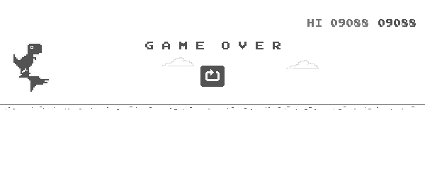

# Deep Q-Network for Chrome Dino Game

This project implements a Deep Q-Network (DQN) agent to play the Chrome Dino Game. The agent learns to play the game by observing the game state and taking actions (jump, crawl, or do nothing) to maximize its score. The implementation uses PyTorch for the neural network and Selenium for game interaction.

Key features:
- Real-time observable training process on browser with Selenium control.
- Allow continue training with a trained model. This helps training quicker and better.
- Reached a high score with simple model structure.
- Provide an image test to help interpret the game states.

## File Structure
```
.
├── t-rex-runner/            # T-rex-runner game: Credit to: https://github.com/wayou/t-rex-runner.git
├── website_vision/
│   ├── main.py              # Main training and testing script
│   ├── DQN.py              # DQN model and trainer implementation
│   ├── env.py              # Game environment wrapper
│   └── dino_agent.py       # Dino game agent implementation
├── runs/                   # Training runs (ignored by git)
│   └── YYYYMMDD_HHMMSS/    # Individual run directories
│       ├── models/         # Saved model checkpoints
│       ├── images/         # Debug images
│       └── logs/           # Training logs
├── run_train.sh              # Training script
├── run_test.sh               # Testing script
├── run_image_test.sh         # Image test to make sure we interpret screenshot correctly
└── .gitignore             # Git ignore file
```

## Current best model

`runs/20250609_034323/models/best_model_at_train_round_4_epoch_89.pt`:
* Use 2 frames separated by a small time increment to represent the state to detect acceleration.
* 1 round of zero-shot training + 4 round of fine-tune training.
* Highest score: 9088




## Run the project step-by-step.

1. creat environment:
```bash
conda create --name rl_dino_runner python=3.10
conda activate rl_dino_runner
pip3 install -r requirements.txt
```

2. Download ChromeDriver that compatible with your Chrome browser.

3. Clone t-rex-runner game from: https://github.com/wayou/t-rex-runner?tab=readme-ov-file
```bash
cd .
git clone https://github.com/wayou/t-rex-runner.git
```

4. Start the t-rex-runner game on an local port. For example, run:
```bash
cd ./t-rex-runner
python3 -m http.server 8000
```
Then the game will run at: 'http://localhost:8000/'

5. Modify 'chrome_driver_path' and 'game_url' args in 'run_train.sh' and the training process.
The image, logs and models will be saved in running folder under './runs'.
```bash
cd ..
bash run_train.sh
```

6. fill in 'model_path' with in 'run_test.sh', and run the model test:
```bash
cd ..
bash run_test.sh
``` 


## Configuration: Key parameters include:
- `train_rounds`: total training rounds
- `epochs`: Number of training epochs
- `steps`: Max steps per epoch
- `min_memory_count_to_start_training`: Number of memory before starting training
- `memory_size`: Replay memory size
- `continue_train_epochs`: Number of training epochs for continue training
- `continue_train_steps`: Max steps per epoch for continue training
- `continue_train_min_memory_count_to_start_training`: Number of memory before starting training for continue training
- `continue_train_memory_size`: Replay memory size for continue training
- `test_epochs`: Number of epochs for testing
- `lr`: Learning rate
- `epsilon`: Maximum exploration rate
- `gamma`: Reward discount factor
- `epsilon_increase`: Epsilon_increasment per epoch
- `net_replace_memory_gap`: Number of memory before repalce eval net with target net
- `batch_size`: Training batch size
- `number_of_actions`: Number_of_actions that agent can do. 2 this in game: 'jump' or 'do nothing'
- `image_wait_time`: time increment for take 2 frames of game play.
- `chrome_driver_path`: Path to chrome driver
- `game_url`: URL to game. Default: "http://localhost:8000/"
- `window_width/window_height`: To control game window size. This is important when decide the states of the game.
- `state_grid_rows/state_grid_cols`: To control the state space. The running track will be devided into [state_grid_rows\*state_grid_cols] blocks to represent the states. Check results of 'run_image_test.sh' for more details.
- `state_binary_threshold`: To decide where is the obstacle. Check results of 'run_image_test.sh' for more details.
- `is_done_threshold`: To decide if game is stopped. Check results of 'run_image_test.sh' for more details.
- `jump_duration`: Sleep time after 'jump'.
- `memory_threshold`: Number of memories to save before starting training.
