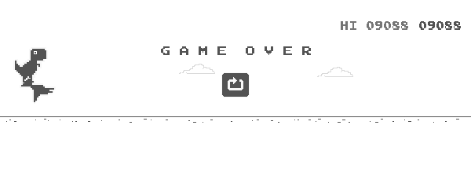
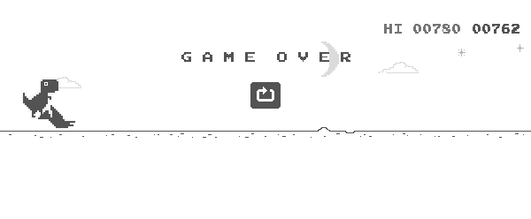
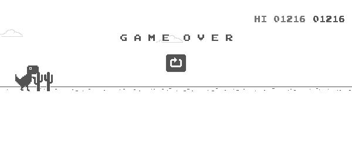
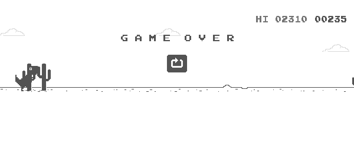

# Deep Reinforcement Learning for Chrome Dino Game

This project implements multiple Deep Reinforcement Learning algorithms to play the Chrome Dino Game. The agents learn to play the game by observing the game state and taking actions (jump or do nothing) to maximize their score. The implementation uses PyTorch for neural networks and Selenium for game interaction.

## Supported Algorithms:
- **DQN** (Deep Q-Network)
- **REINFORCE** (Policy Gradient)
- **Actor-Critic** (Actor-Critic with TD learning)
- **Actor-Critic v2** (Actor-Critic with GAE and trajectory-based learning)
- **PPO** (Proximal Policy Optimization) (Under deveplment) 

Key features:
- Real-time observable training process on browser with Selenium control.
- Multiple RL algorithms for comparison and experimentation.
- Allow continue training with a trained model. This helps training quicker and better.
- Reached high scores with various model structures.
- Provide an image test to help interpret the game states.
- Time-based sampling for improved learning efficiency.

## File Structure
```
.
├── t-rex-runner/            # T-rex-runner game: Credit to: https://github.com/wayou/t-rex-runner.git
├── main.py                 # Main training and testing script
├── DQN.py                  # DQN model and trainer implementation
├── reinforce.py            # REINFORCE model and trainer implementation
├── actor_critic.py         # Actor-Critic model and trainer implementation
├── actor_critic_v2.py      # Actor-Critic v2 with GAE and trajectory-based learning
├── env.py                  # Game environment wrapper
├── dino_agent.py           # Dino game agent implementation
├── runs/                   # Training runs (ignored by git)
│   └── YYYYMMDD_HHMMSS/    # Individual run directories
│       ├── models/         # Saved model checkpoints
│       ├── images/         # Debug images
│       └── logs/           # Training logs
├── train_*.sh              # Individual training scripts for each algorithm
├── test_*.sh               # Individual testing scripts for each algorithm
└── run_image_test.sh       # Image test to make sure we interpret screenshot correctly
```

## Training Results

### DQN Results
`runs/20250609_034323/models/best_model_at_train_round_4_epoch_89.pt`:
* Use 2 frames separated by a small time increment to represent the state to detect acceleration.
* 1 round of zero-shot training + 4 round of fine-tune training.
* Highest score: 9088



### REINFORCE Results
`runs/20250916_023511/models/best_model_at_train_round_4_epoch_1.pt`:
* Policy gradient method with episodic training.
* 5 training rounds with 150 epochs each.
* Memory size: 1000 experiences.
* Learning rate: 0.01
* Highest score: 780.



### Actor-Critic Results
`/runs/20250926_090931/models/best_actor_model_at_train_round_4_epoch_96.pt`
* Actor-Critic with TD learning and replay memory.
* 1 training round with 100 epochs.
* Memory size: 1000 experiences.
* Learning rate: 0.01
* State grid: 1x30 (wider view for better obstacle detection).
* Highest score: 1216.



### Actor-Critic v2 Results
`runs/20250924_231248/models/best_actor_model_at_train_round_0_epoch_97.pt`:
* Actor-Critic with GAE (Generalized Advantage Estimation) and trajectory-based learning.
* Time-based sampling for improved learning efficiency.
* Memory size: 200 trajectories.
* Learning rate: 0.005
* State grid: 1x18 (optimized view).
* Highest score: 2310.



## Run the project step-by-step.

1. creat environment:
```bash
conda create --name rl_dino_runner python=3.10
conda activate rl_dino_runner
pip3 install -r requirements.txt
```

2. Download ChromeDriver that compatible with your Chrome browser.

3. Clone t-rex-runner game from: https://github.com/wayou/t-rex-runner?tab=readme-ov-file
```bash
cd .
git clone https://github.com/wayou/t-rex-runner.git
```

4. Start the t-rex-runner game on an local port. For example, run:
```bash
cd ./t-rex-runner
python3 -m http.server 8000
```
Then the game will run at: 'http://localhost:8000/'

5. Start training with individual algorithm scripts:
The image, logs and models will be saved in running folder under './runs'.

**Training Options:**
```bash
# Train DQN
./train_dqn.sh

# Train REINFORCE
./train_reinforce.sh

# Train Actor-Critic
./train_actor_critic.sh

# Train Actor-Critic v2
./train_actor_critic_v2.sh
```

6. Test trained models with individual test scripts:
**Note:** Update the model paths in the test scripts to point to your actual trained model files. 
**Testing Options:**
```bash
# Test DQN
./test_dqn.sh

# Test REINFORCE
./test_reinforce.sh

# Test Actor-Critic
./test_actor_critic.sh

# Test Actor-Critic v2
./test_actor_critic_v2.sh
```

## Configuration: Key parameters include:

### General Parameters:
- `train_rounds`: Total training rounds
- `epochs`: Number of training epochs
- `steps`: Max steps per epoch
- `test_epochs`: Number of epochs for testing
- `lr`: Learning rate
- `gamma`: Reward discount factor
- `batch_size`: Training batch size
- `number_of_actions`: Number of actions that agent can do (2 in this game: 'jump' or 'do nothing')
- `image_wait_time`: Time increment for taking 2 frames of game play
- `game_url`: URL to game (Default: "http://localhost:8000/")
- `window_width/window_height`: Control game window size (important for state representation)
- `state_grid_rows/state_grid_cols`: Control the state space (track divided into blocks)
- `state_binary_threshold`: Threshold to detect obstacles
- `is_done_threshold`: Threshold to detect game over
- `jump_duration`: Sleep time after 'jump' action

### DQN Specific:
- `min_memory_count_to_start_training`: Number of memories before starting training
- `memory_size`: Replay memory size
- `epsilon`: Maximum exploration rate
- `epsilon_increase`: Epsilon increment per epoch
- `net_replace_memory_gap`: Number of memories before replacing eval net with target net

### Actor-Critic Specific:
- `value_lr`: Learning rate for value network
- `lambda_gae`: GAE parameter for advantage estimation
- `max_steps_per_batch`: Maximum steps per training batch
- `min_trajectories_to_start_training`: Minimum trajectories before starting training

### Continue Training:
- `continue_train_epochs`: Number of training epochs for continue training
- `continue_train_steps`: Max steps per epoch for continue training
- `continue_train_min_memory_count_to_start_training`: Number of memories before starting continue training
- `continue_train_memory_size`: Replay memory size for continue training
